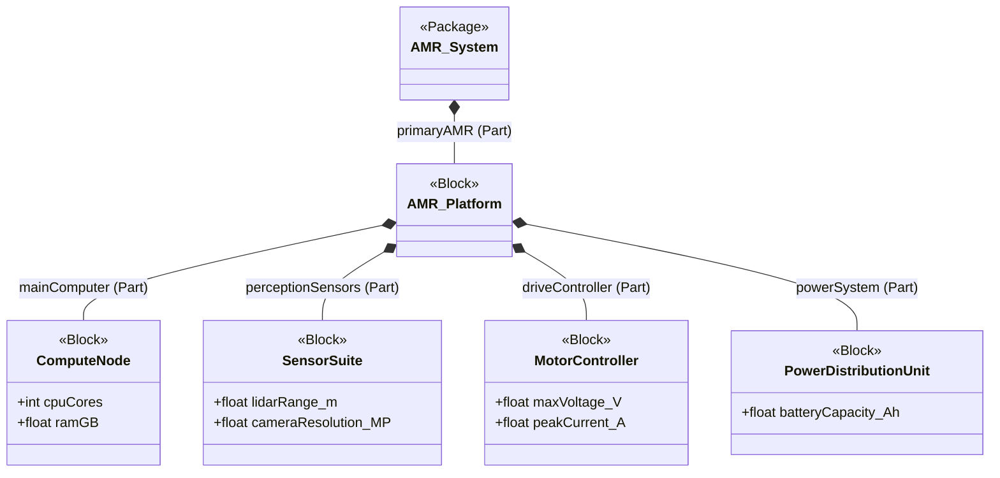

# SysML v2 Models

This directory contains foundational SysML v2 models demonstrating core Model-Based Systems Engineering (MBSE) principles. The target system modeled is an Autonomous Mobile Robot (AMR).

## System Decomposition

The following Mermaid diagram illustrates the structural decomposition of the AMR system, which is formally defined in the accompanying `.sysml` files.

## Included Models

*   **`bdd_amr_architecture.sysml`**: A Block Definition Diagram (BDD) equivalent defining the basic blocks, their attributes (value properties), and interface ports.
*   **`ibd_amr_interconnects.sysml`**: An Internal Block Diagram (IBD) equivalent that instantiates the blocks as parts and connects them via their ports, demonstrating data and power flows.
*   **`pkg_amr_decomposition.sysml`**: A top-level structural decomposition showing the `Package -> Block -> Part -> Port` hierarchy utilizing redefinitions.
*   **`uaf_reference_outline.md`**: A draft outline mapping this system to the Unified Architecture Framework (UAF).

## MBSE Methodology

These models adhere to strict standard-compliant SysML v2 syntax to prove system decomposition and integration methodologies. They demonstrate the transition from conceptual architecture (BDD) to functional interconnects (IBD) and formal hierarchical structures.
